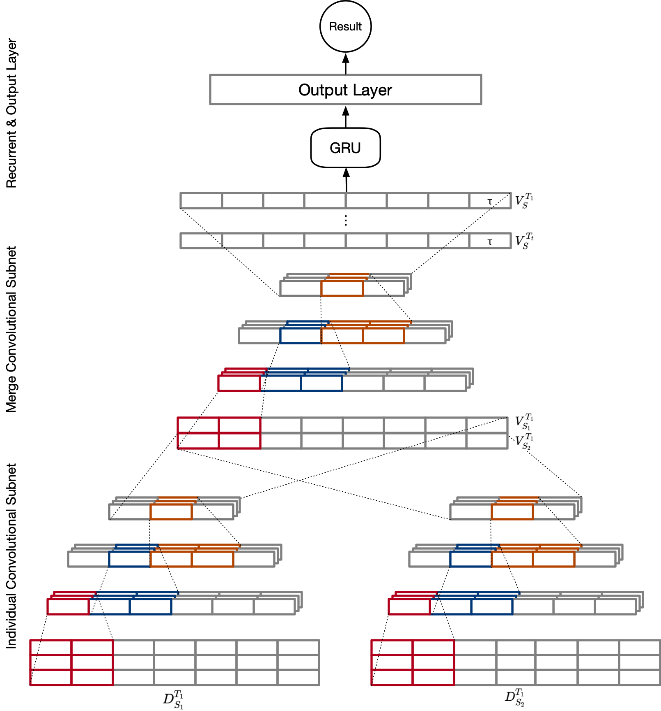
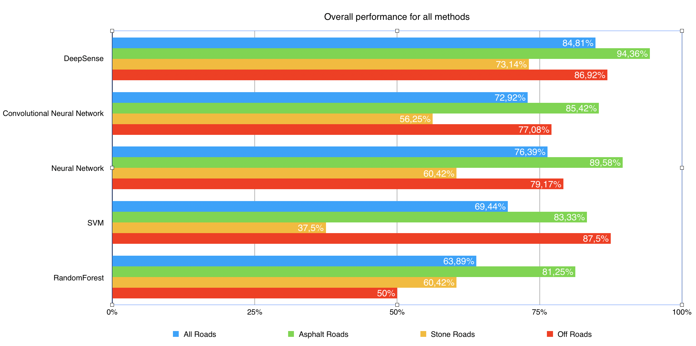

## Road Surface Recognition Based on DeepSense Neural Network using Accelerometer Data

This work is published as a paper in CVPR 2020.



In this paper, we proposed the methodology of recognizing "smooth", "bumpy", and "rough" road surfaces by using a unified sensor fusion framework DeepSense [[1]](https://dl.acm.org/doi/pdf/10.1145/3038912.3052577).
The raw accelerometer data is collected from a mobile phone, and processed on a desktop afterwards. 
During the preprocessing stage, raw sensory data is divided into small chunks and preprocessed using tsfresh [[2]](https://tsfresh.readthedocs.io/en/latest/) to extract time-series features. 
We implemented the DeepSense deep learning framework for the first time and succeeded in deploying it for road surface recognition on the desktop. 
One can also make it possible on a real-time on-board application.

### Motivation
We are releasing our approach's source code for autocalibrating camera and lidar sensors to share with the scientific community and industry with the aim of the collaboration with people around the world to push the boundaries in the field of autonomous driving and intelligent transportation systems. 

### Experiment results


### Dataset
The collected accelerometer data during the experiment can be found [here]().
Each file collected is a session and stored in `csv` format with the following fields:

| Field Name | Data Type | Description |
| :---: | :---: | :---: |
| Timestamp | Int | recorded in milliseconds, starts from 00:00:00.0, 1st of January, 1970 UTC |
| X-raw | Float | Raw accelerometer data for X axis |
| Y-raw | Float | Raw accelerometer data for Y axis |
| Z-raw | Float | Raw accelerometer data for Z axis |
| X-axis | Float | Virtually-oriented accelerometer data for X axis. This accelerometer data is virtually transformed from the phone’s coordinate frame to the world coordinate frame|
| X-axis | Float | Virtually-oriented accelerometer data for Y axis |
| X-axis | Float | Virtually-oriented accelerometer data for Z axis |
| Longitude | Float | WGS84 longitude |
| Latitude | Float | WGS84 latitude |
| Road_type | String | One of the "Smooth", "Bumpy" or "Rough" road type |

### Deployment
For a list of all source code dependencies, please see [here](https://github.com/simonwu53/RoadSurfaceRecognition/blob/master/requirements.txt).

1. Clone the repo to your local drive. 
2. Setup your own Python environment and install the `requirements.txt` by command `pip3 install -r requirements.txt`. 
3. Due to the inconsistency of installing the `tensorflow`, you may need to install it manually.

### Usage
We organized the codes in a modular way to make it convenient for customized usages.
Before start, make sure the folders in the root directory is organized in the following way:
* Data folder at `./data/`
* Execution root at `./src/`

In the `main.py`, there's steps to run cross validation.

```shell script
python main.py
```

### Licence 
NetCalib is released under a [GPLv3.0](https://github.com/simonwu53/NetCalib-Lidar-Camera-Auto-calibration/blob/master/LICENSE) license. 

For a closed-source version of NetCalib for commercial purposes, please contact the authors: [Link]()

### Contributors
Shan Wu; Amnir Hadachi.

### Citation 
If you use our implementation or our data in an academic work, please cite:

Preprint version of the paper is [here]().
